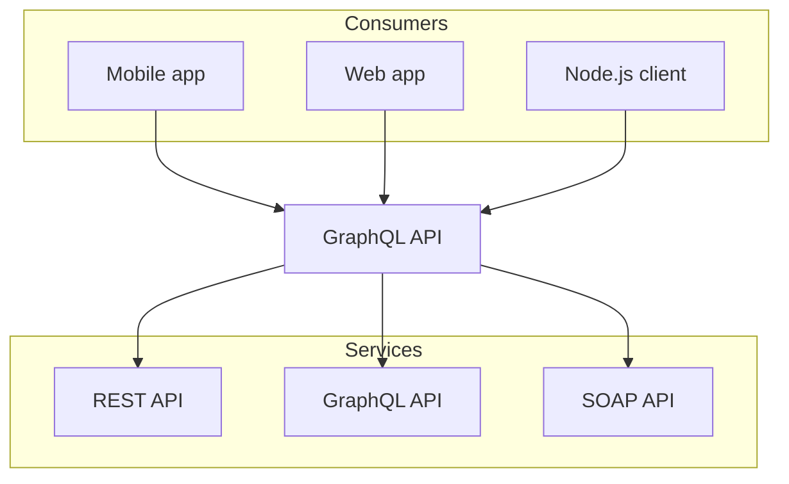

# `@theguild/remark-mermaid`

> Created by Dimitri POSTOLOV https://twitter.com/B2o5T.
>
> Maintained by The Guild https://twitter.com/TheGuildDev.

Remark plugin for replacing ```mermaid code blocks with react `<Mermaid />` component.

- Support MDX2

- Support both dark and light themes. Listening for the `dark` class on the `<html />` element and
  updating the mermaid's theme accordingly

## Install

```sh
npm i @theguild/remark-mermaid
```

## How to Use

Follow code will be converted to a mermaid diagram.

````mdx
// my-page.mdx


````
